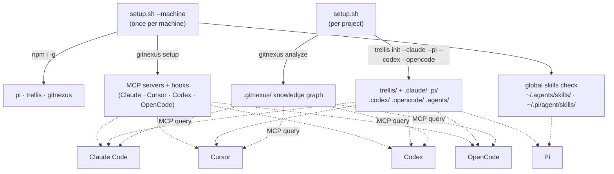

# aitemplate

> One-command bootstrap for **Trellis** + **GitNexus** + global **skills** in any project — wired up for Claude Code, Codex, OpenCode, Pi, and more.

[](LICENSE)
[](https://www.gnu.org/software/bash/)
[](#prerequisites)

Run `setup.sh` in any new project directory to scaffold the full **Trellis** workflow layer, the **GitNexus** code-intelligence index, and the shared skill collections — in seconds, across every coding agent you use.

## Table of contents

- [What this repo is](#what-this-repo-is)
- [The three pillars](#the-three-pillars)
- [How it fits together](#how-it-fits-together)
- [Prerequisites](#prerequisites)
- [Replication guide (start here)](#replication-guide-start-here)
- [Options](#options)
- [What it sets up](#what-it-sets-up)
- [Idempotent & safe](#idempotent--safe)
- [Using the stack](#using-the-stack)
- [Per-agent guide](#per-agent-guide)
- [Global skills](#global-skills)
- [Repository structure](#repository-structure)
- [Troubleshooting](#troubleshooting)
- [License](#license)

## What this repo is

This repo contains a single, dependency-free Bash script — `setup.sh` — that turns an empty or existing project into a fully AI-agent-ready workspace. It does not contain the tools themselves; it bootstraps and wires them together.

Running the script gives you:

1. **A workflow layer** (Trellis) — specs, task PRDs, phased workflow, session journals.
2. **A code-intelligence layer** (GitNexus) — a queryable knowledge graph of your codebase.
3. **Composable skills** (MattPocock's + GitNexus's own) — grilling, TDD, code review, debugging, etc.

…all exposed to whichever coding agents you target (Claude Code, Codex, OpenCode, Pi, Cursor, …) through the right per-agent mechanism (hooks, MCP servers, skill files).

> Why a script and not a template clone? Because Trellis, GitNexus, and the skill installers each have their own CLIs and config formats. `setup.sh` orchestrates them in the right order with the right flags, idempotently, so you get a known-good setup every time.

## The three pillars

| Pillar | What it does | Tooling | Installed where |
|--------|--------------|---------|-----------------|
| **Trellis** | Spec-driven development: a 4-phase workflow (Plan → Implement → Verify → Finish), per-task specs, session journals, gated tasks. | `trellis` CLI (`@mindfoldhq/trellis`) | Per-project `.trellis/` + per-agent config dirs |
| **GitNexus** | Indexes your codebase into a knowledge graph (calls, imports, execution flows, blast radius) and exposes it to agents via MCP/CLI. | `gitnexus` CLI (`gitnexus`) | Per-project `.gitnexus/` index + MCP server config |
| **Skills** | Composable engineering & productivity skills (grilling, TDD, code review, debugging, domain modeling). | MattPocock skills + GitNexus skills | Global `~/.agents/skills/` & `~/.pi/agent/skills/`, auto-loaded |

## How it fits together



## Prerequisites

**Always required:**

- **macOS or Linux** with **Bash 4+**.
- **git** — Trellis uses worktrees, task branches, and commit metadata.
- **Python 3.9+** (`python3` on macOS/Linux) — Trellis renders this command into its hook scripts and warns if it's older than 3.9.

**Required for `--machine` (installs the CLIs and configures MCP/hooks):**

- **Node.js 18+ (LTS)** + **npm** — runs the `trellis`, `gitnexus`, and `pi` CLIs.

> Windows? Use WSL2 with Bash. The script assumes a POSIX shell.

## Replication guide (start here)

Two phases: a **once-per-machine** bootstrap, then a **per-project** init you repeat for every repo.

### Phase 1 — First time on a new machine

```bash
# 1. Clone this template anywhere (you only need setup.sh)
git clone <your-fork-or-origin-url> ~/projects/aitemplate

# 2. Run the machine bootstrap. This:
#      • npm installs -g:  pi, trellis, gitnexus   (skips any already present)
#      • runs `gitnexus setup`  → registers MCP servers + hooks + global gitnexus skills
#      • checks for global skill collections in ~/.agents/skills/ and ~/.pi/agent/skills/
bash ~/projects/aitemplate/setup.sh --machine
```

Then install the global skill collections **once** (the script detects but does not auto-install non-GitNexus sets, since their installers vary). See [Global skills](#global-skills) for the verified commands.

### Phase 2 — Bootstrap a project

```bash
cd ~/projects/some-new-repo

# Per-project init only (skips the machine step).
# Creates .trellis/, platform config dirs, AGENTS.md, CLAUDE.md, and the .gitnexus/ index.
bash ~/projects/aitemplate/setup.sh
```

### Phase 3 — Commit the scaffolding

`setup.sh` finishes by printing next steps. The generated files belong in version control so your whole team inherits the same workflow:

```bash
git add .trellis .claude .pi .codex .agents AGENTS.md CLAUDE.md
git commit -m "chore: bootstrap trellis + gitnexus"
```

> **What stays out of git:** `.gitnexus/` (the index is machine-regenerated) and `.trellis/workspace/` (personal session journals). Trellis writes these gitignore entries for you — verify `.gitignore` after init.

### Doing it all in one shot

On a fresh machine with a brand-new project, `--machine` runs Phase 1 **and then** continues into Phase 2 for the current directory:

```bash
cd ~/projects/brand-new-repo
bash ~/projects/aitemplate/setup.sh --machine
```

## Options

```
--machine                 Also run first-time-per-machine setup first
--platforms <a,b,c>       Trellis platforms (default: claude,pi,codex,opencode)
--user <name>             Developer identity (default: git user.name | $USER | developer)
--no-analyze              Skip `gitnexus analyze`
-f, --force               Re-sync platform skills even if .trellis exists
-h, --help                Show help
```

**Supported platforms** (each becomes a `trellis init --<platform>` flag):
`claude`, `pi`, `codex`, `opencode`, `cursor`, `kilo`, `kiro`, `gemini`, `antigravity`, `windsurf`, `qoder`, `codebuddy`, `copilot`, `droid`.

```bash
# Customise platforms + identity
bash setup.sh --platforms claude,cursor --user ada
```

## What it sets up

| Component | Per-project | Once-per-machine (`--machine`) |
|-----------|:-----------:|:------------------------------:|
| `.trellis/` (workflow, spec, scripts, tasks, workspace) | ✓ | |
| Platform skill sync — `.claude/`, `.pi/`, `.codex/`, `.agents/` | ✓ | |
| `AGENTS.md`, `CLAUDE.md` | ✓ | |
| `.gitnexus/` knowledge-graph index (`gitnexus analyze`) | ✓ | |
| Global CLIs (`pi`, `trellis`, `gitnexus`) | | ✓ |
| `gitnexus setup` — MCP servers + hooks + gitnexus skills | | ✓ |
| Global skill collections check (`~/.agents/skills/`) | | ✓ |

## Idempotent & safe

- Detects an existing `.trellis/` and skips `trellis init` (use `--force` to re-sync platform skills).
- Detects an existing `.gitnexus/` and skips re-indexing.
- `gitnexus setup` merges into existing MCP/hook config (safe to re-run).
- `npm install -g` is skipped if the binary is already present.

## Using the stack

### Pillar 1 — Trellis (spec-driven workflow)

Trellis adds a 4-phase workflow on top of your agent: **Plan → Implement → Verify → Finish**. After `setup.sh` runs `trellis init`, you get:

```
.trellis/
├── workflow.md          # How the workflow works — read this first
├── spec/                # Your coding conventions (frontend/, backend/, guides/)
├── workspace/           # Personal session journals (gitignored)
└── tasks/               # Task PRDs & tracking
```

**Getting started:**

1. Open `.trellis/spec/<backend|frontend>/index.md` and fill in your conventions. Be specific — include file paths and real code. Vague specs are ignored; specific specs are followed.
2. Start a session in your agent. Describe what you want; Trellis routes the turn through the phased workflow and writes a task PRD.
3. Iterate. Each task gets its own spec injected via hooks.

**Useful CLI commands (run outside the agent):**

```bash
trellis init -u jane             # set developer identity (else git user.name)
trellis update --dry-run         # preview managed-file changes before applying
trellis update --force           # overwrite all managed files
trellis uninstall --dry-run      # preview full removal (removes only tracked files)
```

> Docs: <https://docs.trytrellis.app>

### Pillar 2 — GitNexus (code intelligence)

GitNexus indexes your repo with Tree-sitter into a knowledge graph — every call, import, execution flow, and community — then exposes ~16 MCP tools so your agent can ask structural questions instead of grepping blindly.

`setup.sh --machine` runs `gitnexus setup` (registers the MCP server for Claude Code, Cursor, Codex, OpenCode + installs hooks and global gitnexus skills). Per-project, it runs `gitnexus analyze` to build `.gitnexus/`.

**What you can query from the agent** (the GitNexus MCP tools, once the server is configured):

- "What calls `validateUser`, and what will break if I change it?" → `impact` / blast-radius.
- "How does the login flow work?" → `query` (process / execution-flow search).
- "Show callers, callees, overrides of this symbol." → `context`.
- "Which components fetch `/api/grants`?" → `route_map` / `api_impact`.

**Refresh after big changes:**

```bash
gitnexus analyze                 # rebuild the .gitnexus/ index
gitnexus analyze --help          # all indexing options
```

> Docs/README: <https://github.com/abhigyanpatwari/GitNexus>

### Pillar 3 — Composable skills (MattPocock + GitNexus)

Two skill families, both auto-available once installed:

**MattPocock's skills** — small, composable, model-agnostic skills for real engineering. Highlights:

| Skill | When to reach for it |
|-------|----------------------|
| `/grill-with-docs` (eng) · `/grill-me` (prod) | Align with the agent *before* coding; build a shared vocabulary (`CONTEXT.md` + ADRs) |
| `/tdd` | Red-green-refactor loop with guidance on good/bad tests |
| `/diagnosing-bugs` | Disciplined, phase-gated debugging loop |
| `/code-review` | Review changes against repo standards + the originating spec |
| `/domain-modeling` | Pin down ubiquitous language, record decisions |
| `/codebase-design` | Deepen modules, find the right seams |
| `/research` | Delegate reading legwork to a background agent |
| `/to-tickets` · `/triage` | Turn requests into tracked tickets; triage by labels |
| `/wizard` | Generate a human-run bash wizard for steps only you can do |

**GitNexus's own skills** (`gitnexus-*`) — installed automatically by `gitnexus setup`; guide the agent through GitNexus's query/impact/refactor/PR workflows.

> Repo: <https://github.com/mattpocock/skills>

## Per-agent guide

`setup.sh` wires everything for the default platforms `claude,pi,codex,opencode`. Here is how each agent consumes the stack.

### Claude Code

- **Trellis**: `--claude` creates `.claude/` with hooks, skills, agents, and session-boundary commands. Trellis slash commands and skills appear in-session.
- **GitNexus**: `gitnexus setup` registers the GitNexus MCP server in Claude Code config; the graph tools are available as MCP tools.
- **MattPocock skills**: install as the managed plugin (auto-updates):
  ```bash
  claude plugins install mattpocock-skills
  # or, from inside a session:  /plugin install mattpocock-skills
  ```
  Prefer owning/editable copies instead? `npx skills@latest add mattpocock/skills` (then pick Claude Code). Don't install both — you'll get every skill twice.

### Codex

- **Trellis**: `--codex` creates `.codex/`.
- **GitNexus**: `gitnexus setup` registers the MCP server for Codex.
- **MattPocock skills**:
  ```bash
  npx skills@latest add mattpocock/skills   # choose codex; include setup-matt-pocock-skills
  ```
  A native Codex plugin is on MattPocock's roadmap; until then use `skills.sh`.

### OpenCode

- **Trellis**: `--opencode` creates `.opencode/`.
- **GitNexus**: `gitnexus setup` registers the MCP server for OpenCode.
- **MattPocock skills**:
  ```bash
  npx skills@latest add mattpocock/skills   # choose opencode
  ```

### Pi

- **Trellis**: `--pi` creates `.pi/`.
- **GitNexus**: global GitNexus skills are auto-loaded from `~/.pi/agent/skills/` in every project (no per-project step).
- **MattPocock skills**: install into Pi's global skill dir:
  ```bash
  pi install git:github.com/mattpocock/skills      # verify the exact command for your pi setup
  # generic alternative:
  npx skills@latest add mattpocock/skills          # choose pi
  ```

### After installing skills (any agent)

Run once per repo to configure issue tracker, triage labels, and doc location:

```
/setup-matt-pocock-skills
```

Update skill copies later with:

```bash
npx skills update
```

## Global skills

Skills in `~/.agents/skills/` and `~/.pi/agent/skills/` are **auto-loaded by Pi in every project** — they only need installing once per machine. Other agents read them per-project via their config dirs (`.claude/`, `.codex/`, `.opencode/`).

`setup.sh --machine` **detects** the global collections but does not auto-install non-GitNexus sets (their installers vary). If missing, it prints guidance. The verified install commands:

```bash
# Claude Code — managed plugin (recommended), or see "Per-agent guide" for editable copies
claude plugins install mattpocock-skills

# Codex / OpenCode / Pi / any agent — editable copies you own
npx skills@latest add mattpocock/skills
```

GitNexus's own skills are installed automatically by `gitnexus setup`.

## Repository structure

```
aitemplate/
├── setup.sh        # the bootstrap script (the whole point of this repo)
├── README.md       # this file
├── LICENSE         # MIT
├── .editorconfig   # editor consistency
└── .gitignore      # ignores generated .trellis/ and .gitnexus/ in THIS template repo
```

## Troubleshooting

- **`trellis CLI missing` / `gitnexus CLI missing`** — you ran the per-project script on a machine that hasn't been bootstrapped. Either re-run with `--machine`, or install the CLIs manually:
  ```bash
  npm i -g @mindfoldhq/trellis gitnexus @earendil-works/pi-coding-agent
  ```
- **`node not found` / `npm not found`** — `--machine` needs Node.js LTS. Install from <https://nodejs.org>, then re-run.
- **`gitnexus setup reported issues`** — usually means MCP/hook config already exists; the merge is idempotent and safe to re-run. Re-run `gitnexus setup` to confirm.
- **`gitnexus analyze failed`** — re-run it manually: `gitnexus analyze`. First indexing of a large repo can take a while.
- **Trellis warns about Python < 3.9** — install/upgrade `python3`; Trellis renders `python3` into its hook scripts on macOS/Linux.
- **Skills appear twice / commands conflict** — you installed MattPocock skills two ways (plugin + `skills.sh`). Pick one and remove the other.
- **Want to re-sync after editing Trellis specs** — `bash setup.sh --force` re-runs `trellis init --force` without wiping your `.trellis/` content.

## License

Released under the [MIT License](LICENSE).
